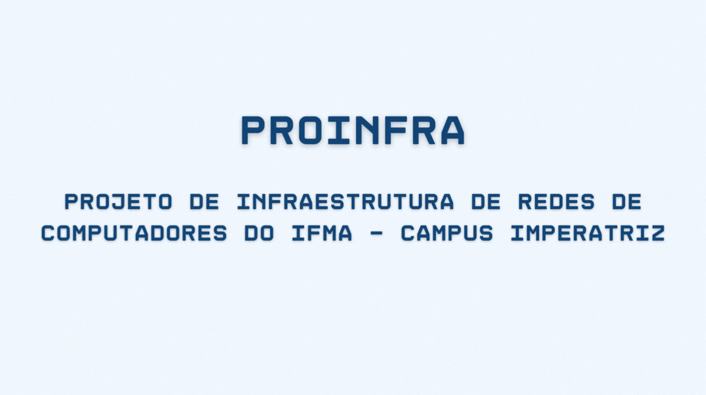

# ProINFRA - Projeto de Infraestrutura de Redes de Computadores do IFMA - Campus Imperatriz

Esse projeto é uma contribuição dos alunos do 8º período de Ciência da Computação para a **reestruturação arquitetônica da infraestrutura de redes de computadores** do Instituto Federal de Educação, Ciência e Tecnologia do Maranhão - Campus Imperatriz (IFMA) sob orientação do professor [Paulo Henrique Sousa Barbosa](https://github.com/agenteph) na disciplina de Telecomunicações.

Os integrantes deste projeto são:

- [Benjamim Borges](https://github.com/BenjamimBorges): Seleção de equipamentos e cabos que serão utilizados

  > Responsável por procurar os modelos exatos de equipamentos de rede que serão utilizados no projeto, como por exemplo os switches, armarios, cabos etc.

- [Elvis Rodrigues Almeida](https://github.com/Elvis-Almeida): Distribuição do cabeamento de rede;

  > Responsável por definir por onde e como serão utilizados os cabos de rede, definindo por exemplo em quais pontos será utilizado fibra ou cabo metálico.

- [Jônatas Mota Da Silva Junior](https://github.com/jonatasmota404): Desenhar e legendar plata baixa;

  > Responsável pelo desenho completo da planta baixa do projeto quanto as suas legendas

- [Lucio Gomes Pinto](https://github.com/Luciogp): Analista de mercado;

  > Responsável por catalogar e analzar os preços, lojas e links nos quais poderão ser comprados os equipamentos de todo o projeto.

- [Vinicius França](https://github.com/vinicius4006): Distribuição dos equipamentos de rede;

  > Responsável por definir onde e como serão utilizados equipamentos de redes como armarios, switches, roteadores etc e gerir o projeto em geral.

- [Wenderson Melo](https://github.com/wendersoon): Documentação de todas as etapas do projeto.

  > Responsável por toda a documentação do projeto

---

[**Acesse a Wiki com a documentação completa**](https://github.com/wendersoon/ProINFRA/wiki)

